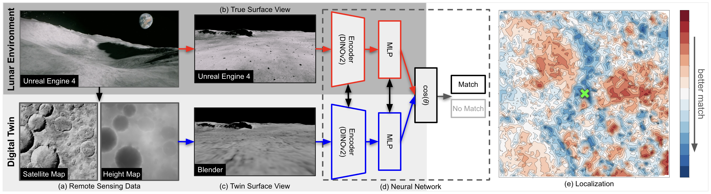

# Absolute Localization through Vision Transformer Matching of Planetary Surface Perspective Imagery from a Digital Twin

**Publication:** 2025 IEEE/RSJ International Conference on Intelligent Robots and Systems (IROS 2025)

**Authors:** Philippe Ludivig (Orion Labs)\*, Benjamin Wu (NVIDIA, National Astronomical Observatory of Japan)\*, Maciej Zurad (Orion Labs)\* 

\* Equal contribution

---

## Abstract

We present a novel machine learning framework and synthetic dataset for performing absolute localization on planetary surfaces where satellite navigation systems are unavailable. Current approaches involve manual surface-to-satellite image matching by human rover operators, limiting the rate of planetary exploration and scientific utilization. Our framework leverages deep neural networks to perform image similarity matching between a rover’s onboard cameras and corresponding ground-view images from a digital twin environment created from satellite and elevation maps. The rover views, satellite, and elevation maps are taken from a pho- torealistic lunar environment simulated in a 3D graphics engine (Unreal Engine 4). The synthetic ground-view reprojections are generated using an open-source 3D graphics software (Blender). In total, we generate a dataset of 1.68 million images at 210,000 locations. The images and corresponding metadata are then used to train a DINOv2 vision transformer image similarity model through supervised fine-tuning to determine matching locations between the rover views and candidate reprojections. Through this method, our model is able to determine the ground truth location within 5m using just 2.5% of the search space, outperforming other deep learning and classical image comparison benchmarks.

---


*Figure 1: Overview of our absolute localization method using a simulated lunar environment as proxy. (a) Remote sensing data in the form of satellite and elevation maps is gathered, along with (b) rover-view surface images. A digital twin environment is created from the satellite and elevation maps, where (c) twin surface views can be generated through reprojections at known locations. (d) A DINOv2-powered vision transformer image similarity model is used to compare (b) with various candidates of (c). (e) Absolute localization is derived from a map of the closest matching locations.*


---

## Key Contributions

- We propose a novel absolute localization framework using transformer-based neural networks to match rover imagery with synthetic views from a simulated lunar “digital twin”.
- We construct and release a large-scale synthetic dataset of over 1.6 million images for training and evaluation.
- Experimental results show that our method outperforms
classical and other deep learning baselines, significantly reducing the search space needed for accurate localiza- tion.

---

## Data

We provide a **sample dataset** for demonstration and testing.
- Download: [Data Sample for 100 Locations](https://drive.google.com/drive/folders/1pdXlk8cK5M27rcahnQqCrwFcqGs877WD?usp=sharing)

---

## Code

Code and documentation to be provided after publication.

---

## Citation

If you use our code or data, please cite:

**BibTeX**
```
@inproceedings{YOUR-KEY,
author = {P. Ludivig, B. Wu, M. Zurad},
title = {Absolute Localization through Vision Transformer Matching of Planetary Surface Perspective Imagery from a Digital Twin},
booktitle = {Proceedings of the IEEE/RSJ Int. Conf. on Intelligent Robots and Systems (IROS)},
year = {2025},
url = {https://arxiv.org/abs/XXX.XXXXX}
}
```

